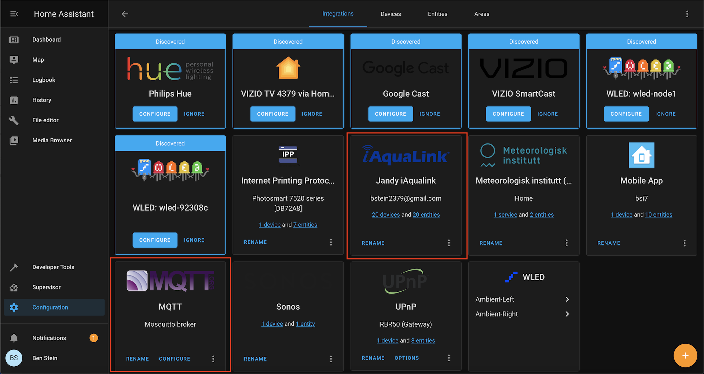
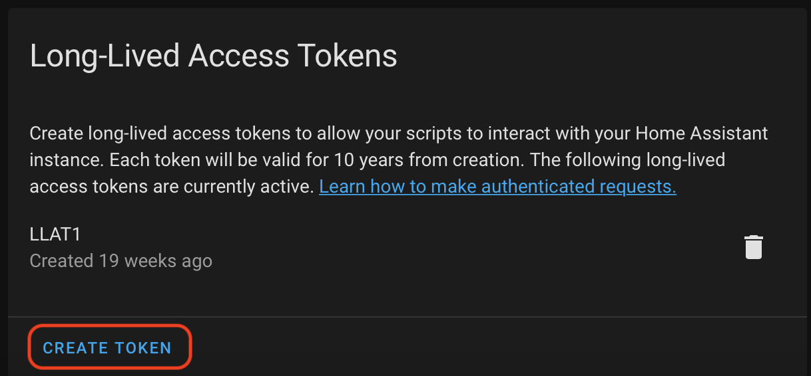
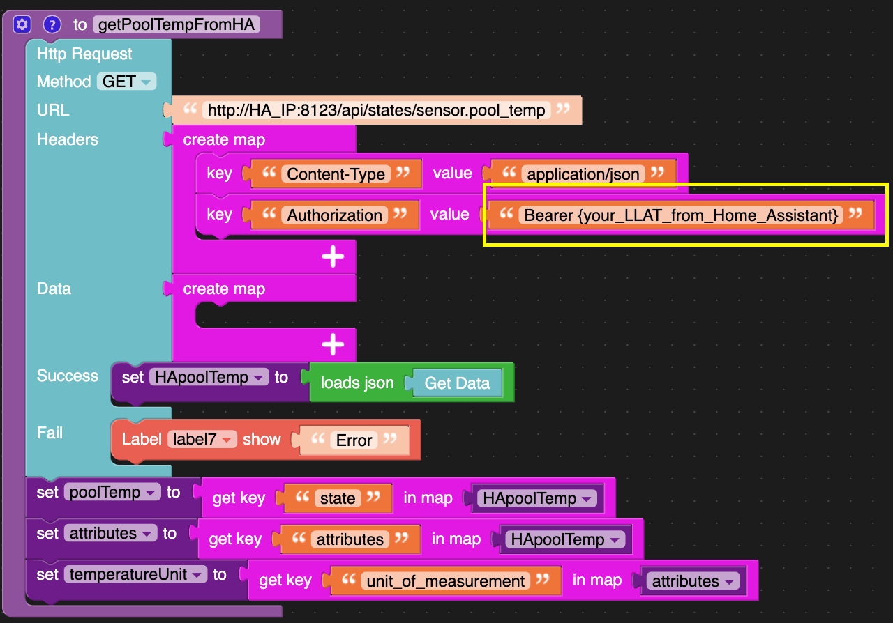
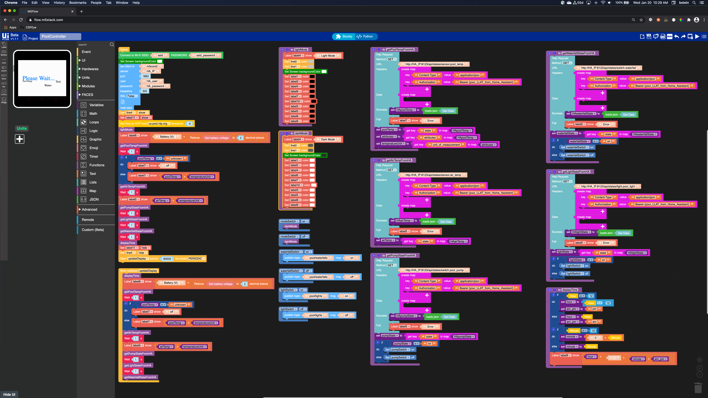

# M5Stack-IoT-Pool-Controller
IoT pool controller using the M5Stack Core2 and integrations with MQTT and Jandy iAquaLink on Home Assistant (HA).


## Demo Video
[https://twitter.com/bstein2379/status/1326874386654240770](https://twitter.com/bstein2379/status/1326874386654240770)


## Prerequisites
For this project, you will need Home Assistant already set up and running. Then you will need to enable the integrations for Jandy iAquaLink and MQTT under the Configuration menu, then Integrations.


I won't cover those instructions in the interest of time and also there are already many YouTube videos and documentation on those topics. Here are some examples.
- [https://www.youtube.com/results?search_query=home+assistant](https://www.youtube.com/results?search_query=home+assistant)
- [https://www.youtube.com/results?search_query=home+assistant+mqtt](https://www.youtube.com/results?search_query=home+assistant+mqtt)
- [https://www.home-assistant.io/integrations/iaqualink/](https://www.home-assistant.io/integrations/iaqualink/)

You will also need to set up a Long-Lived Access Token (LLAT) within Home Assistant. Go to your Profile within HA and scroll down to the bottom where you see the link for "Create Token" under Long-Lived Access Tokens. You will need to copy/paste this API token into the uiFlow Http Request API Header blocks (key "Authorization" value "Bearer {your_LLAT_from_Home_Assistant}". 



Note: keep the word *Bearer* in front of the API token.




## uiFlow Program
*Note: at the time of writing, I'm using uiFlow V1.7.1*

Here is the uiFlow program for the M5Stack IoT Pool Controller. You will need to replace or update the following with your local configuration. The link to the m5f file is [here](./PoolController.m5f).
- ssid = your local WiFi SSID
- password = your local WiFi SSID password
- HA_IP = your local Home Assistant IP address
- HA_user = A user set up on Home Assistant
- HA_password = the password to the HA user
- NTP host pool and timezone (optional) = change to an NTP server and timezone offset applicable to your region (mine is set to US Eastern time zone)
- If you changed the default MQTT port 1883, you should also change it in the uiFlow program.
- If you changed the default Home Assistant port 8123, you should also change it in the uiFlow program.



## MicroPython code
```
from m5stack import *
from m5stack_ui import *
from uiflow import *
import urequests
import wifiCfg
import json

from m5mqtt import M5mqtt
import time

screen = M5Screen()
screen.clean_screen()
screen.set_screen_bg_color(0xFFFFFF)


HApoolTemp = None
poolTemp = None
HAairTemp = None
airTemp = None
HApumpState = None
pumpState = None
hour = None
HAwaterfallState = None
waterfallState = None
HAlightState = None
lightState = None
attributes = None
am_pm = None
minute = None
temperatureUnit = None

wifiCfg.doConnect('ssid', 'ssid_password')
line0 = M5Line(x1=0, y1=120, x2=320, y2=120, color=0xaaaaaa, width=5, parent=None)
modeSwitch = M5Switch(x=6, y=208, w=70, h=30, bg_c=0xebe9e9, color=0x4a4b4c, parent=None)
line1 = M5Line(x1=160, y1=30, x2=160, y2=200, color=0xaaaaaa, width=5, parent=None)
line2 = M5Line(x1=0, y1=31, x2=320, y2=31, color=0x0288fb, width=7, parent=None)
line3 = M5Line(x1=0, y1=200, x2=320, y2=200, color=0x0288fb, width=5, parent=None)
label0 = M5Label('Pool Controller', x=6, y=3, color=0x0288fb, font=FONT_MONT_22, parent=None)
label1 = M5Label('Lights', x=53, y=50, color=0x000, font=FONT_MONT_14, parent=None)
label2 = M5Label('Waterfalls', x=213, y=50, color=0x000, font=FONT_MONT_14, parent=None)
label4 = M5Label('Mode', x=83, y=217, color=0x000, font=FONT_MONT_14, parent=None)
label6 = M5Label('Text', x=197, y=217, color=0x000, font=FONT_MONT_14, parent=None)
label7 = M5Label('Text', x=250, y=160, color=0x000, font=FONT_MONT_20, parent=None)
label9 = M5Label('Text', x=210, y=1, color=0x000, font=FONT_MONT_22, parent=None)
lightSwitch = M5Switch(x=12, y=70, w=120, h=35, bg_c=0xCCCCCC, color=0x0288fb, parent=None)
label10 = M5Label('Air:', x=207, y=135, color=0x000, font=FONT_MONT_20, parent=None)
waterfallSwitch = M5Switch(x=189, y=70, w=120, h=35, bg_c=0xCCCCCC, color=0x0288FB, parent=None)
label3 = M5Label('Water:', x=175, y=160, color=0x000, font=FONT_MONT_20, parent=None)
label5 = M5Label('Text', x=250, y=135, color=0x000, font=FONT_MONT_20, parent=None)
label8 = M5Label('Pool Pump', x=31, y=134, color=0x000, font=FONT_MONT_14, parent=None)
pumpSwitch = M5Switch(x=9, y=151, w=120, h=35, bg_c=0xCCCCCC, color=0x0288FB, parent=None)
line4 = M5Line(x1=0, y1=120, x2=320, y2=120, color=0xfcfcfc, width=240, parent=None)
label11 = M5Label('Please Wait...', x=29, y=104, color=0x0288fb, font=FONT_MONT_40, parent=None)


# HTTP GET pool temperature from Home Assistant
def getPoolTempFromHA():
  global HApoolTemp, poolTemp, HAairTemp, airTemp, HApumpState, pumpState, hour, HAwaterfallState, waterfallState, HAlightState, lightState, attributes, am_pm, minute, temperatureUnit
  try:
    req = urequests.request(method='GET', url='http://HA_IP:8123/api/states/sensor.pool_temp', headers={'Content-Type':'application/json','Authorization':'Bearer {your_LLAT_from_Home_Assistant}'})
    HApoolTemp = json.loads((req.text))
  except:
    label7.set_text('Error')
  poolTemp = HApoolTemp['state']
  attributes = HApoolTemp['attributes']
  temperatureUnit = attributes['unit_of_measurement']

# Function for setting light mode
def lightMode():
  global HApoolTemp, poolTemp, HAairTemp, airTemp, HApumpState, pumpState, hour, HAwaterfallState, waterfallState, HAlightState, lightState, attributes, am_pm, minute, temperatureUnit
  label4.set_text('Light Mode')
  line0.set_color(0xcccccc)
  line1.set_color(0xcccccc)
  screen.set_screen_bg_color(0xffffff)
  label1.set_text_color(0x000000)
  label2.set_text_color(0x000000)
  label4.set_text_color(0x000000)
  label6.set_text_color(0x000000)
  label7.set_text_color(0x000000)
  label10.set_text_color(0x000000)
  label3.set_text_color(0x000000)
  label5.set_text_color(0x000000)
  label8.set_text_color(0x000000)
  label9.set_text_color(0x000000)

# Function for setting dark mode
def darkMode():
  global HApoolTemp, poolTemp, HAairTemp, airTemp, HApumpState, pumpState, hour, HAwaterfallState, waterfallState, HAlightState, lightState, attributes, am_pm, minute, temperatureUnit
  label4.set_text('Dark Mode')
  line0.set_color(0x666666)
  line1.set_color(0x666666)
  screen.set_screen_bg_color(0x333333)
  label1.set_text_color(0xffffff)
  label2.set_text_color(0xffffff)
  label4.set_text_color(0xffffff)
  label6.set_text_color(0xffffff)
  label7.set_text_color(0xffffff)
  label10.set_text_color(0xffffff)
  label3.set_text_color(0xffffff)
  label5.set_text_color(0xffffff)
  label8.set_text_color(0xffffff)
  label9.set_text_color(0xffffff)

# HTTP GET outside air temperature from Home Assistant
def getAirTempFromHA():
  global HApoolTemp, poolTemp, HAairTemp, airTemp, HApumpState, pumpState, hour, HAwaterfallState, waterfallState, HAlightState, lightState, attributes, am_pm, minute, temperatureUnit
  try:
    req = urequests.request(method='GET', url='http://HA_IP:8123/api/states/sensor.air_temp', headers={'Content-Type':'application/json','Authorization':'Bearer {your_LLAT_from_Home_Assistant}'})
    HAairTemp = json.loads((req.text))
  except:
    label5.set_text('Error')
  airTemp = HAairTemp['state']

# HTTP GET the pool pump state from Home Assistant
def getPumpStateFromHA():
  global HApoolTemp, poolTemp, HAairTemp, airTemp, HApumpState, pumpState, hour, HAwaterfallState, waterfallState, HAlightState, lightState, attributes, am_pm, minute, temperatureUnit
  try:
    req = urequests.request(method='GET', url='http://HA_IP:8123/api/states/switch.pool_pump', headers={'Content-Type':'application/json','Authorization':'Bearer {your_LLAT_from_Home_Assistant}'})
    HApumpState = json.loads((req.text))
  except:
    label5.set_text('Error')
  pumpState = HApumpState['state']
  if pumpState == 'on':
    pumpSwitch.set_on()
  else:
    pumpSwitch.set_off()

# Format the time
def displayTime():
  global HApoolTemp, poolTemp, HAairTemp, airTemp, HApumpState, pumpState, hour, HAwaterfallState, waterfallState, HAlightState, lightState, attributes, am_pm, minute, temperatureUnit
  if (rtc.datetime()[4]) > 12:
    hour = (rtc.datetime()[4]) - 12
    am_pm = 'pm'
  else:
    hour = rtc.datetime()[4]
    am_pm = 'am'
  if (rtc.datetime()[5]) < 10:
    minute = (str('0') + str((rtc.datetime()[5])))
  else:
    minute = rtc.datetime()[5]
  label9.set_text(str((str(hour) + str(((str(':') + str(((str(minute) + str(am_pm))))))))))

# HTTP GET the waterfall pump state from Home Assistant
def getWaterfallStateFromHA():
  global HApoolTemp, poolTemp, HAairTemp, airTemp, HApumpState, pumpState, hour, HAwaterfallState, waterfallState, HAlightState, lightState, attributes, am_pm, minute, temperatureUnit
  try:
    req = urequests.request(method='GET', url='http://HA_IP:8123/api/states/switch.waterfall', headers={'Content-Type':'application/json','Authorization':'Bearer {your_LLAT_from_Home_Assistant}'})
    HAwaterfallState = json.loads((req.text))
  except:
    label5.set_text('Error')
  waterfallState = HAwaterfallState['state']
  if waterfallState == 'on':
    waterfallSwitch.set_on()
  else:
    waterfallSwitch.set_off()

# HTTP GET the pool lights state from Home Assistant
def getLightStateFromHA():
  global HApoolTemp, poolTemp, HAairTemp, airTemp, HApumpState, pumpState, hour, HAwaterfallState, waterfallState, HAlightState, lightState, attributes, am_pm, minute, temperatureUnit
  try:
    req = urequests.request(method='GET', url='http://HA_IP:8123/api/states/light.pool_light', headers={'Content-Type':'application/json','Authorization':'Bearer {your_LLAT_from_Home_Assistant}'})
    HAlightState = json.loads((req.text))
  except:
    label5.set_text('Error')
  lightState = HAlightState['state']
  if lightState == 'on':
    lightSwitch.set_on()
  else:
    lightSwitch.set_off()


def modeSwitch_on():
  global HApoolTemp, poolTemp, HAairTemp, airTemp, HApumpState, pumpState, hour, HAwaterfallState, waterfallState, HAlightState, lightState, attributes, am_pm, minute, temperatureUnit
  darkMode()
  pass
modeSwitch.on(modeSwitch_on)

def modeSwitch_off():
  global HApoolTemp, poolTemp, HAairTemp, airTemp, HApumpState, pumpState, hour, HAwaterfallState, waterfallState, HAlightState, lightState, attributes, am_pm, minute, temperatureUnit
  lightMode()
  pass
modeSwitch.off(modeSwitch_off)

def waterfallSwitch_on():
  global HApoolTemp, poolTemp, HAairTemp, airTemp, HApumpState, pumpState, hour, HAwaterfallState, waterfallState, HAlightState, lightState, attributes, am_pm, minute, temperatureUnit
  m5mqtt.publish(str('pool/waterfalls'),str('on'))
  pass
waterfallSwitch.on(waterfallSwitch_on)

def waterfallSwitch_off():
  global HApoolTemp, poolTemp, HAairTemp, airTemp, HApumpState, pumpState, hour, HAwaterfallState, waterfallState, HAlightState, lightState, attributes, am_pm, minute, temperatureUnit
  m5mqtt.publish(str('pool/waterfalls'),str('off'))
  pass
waterfallSwitch.off(waterfallSwitch_off)

def lightSwitch_on():
  global HApoolTemp, poolTemp, HAairTemp, airTemp, HApumpState, pumpState, hour, HAwaterfallState, waterfallState, HAlightState, lightState, attributes, am_pm, minute, temperatureUnit
  m5mqtt.publish(str('pool/lights'),str('on'))
  pass
lightSwitch.on(lightSwitch_on)

def lightSwitch_off():
  global HApoolTemp, poolTemp, HAairTemp, airTemp, HApumpState, pumpState, hour, HAwaterfallState, waterfallState, HAlightState, lightState, attributes, am_pm, minute, temperatureUnit
  m5mqtt.publish(str('pool/lights'),str('off'))
  pass
lightSwitch.off(lightSwitch_off)

@timerSch.event('updateDisplay')
def tupdateDisplay():
  global HApoolTemp, poolTemp, HAairTemp, airTemp, HApumpState, pumpState, hour, HAwaterfallState, waterfallState, HAlightState, lightState, attributes, am_pm, minute, temperatureUnit
  displayTime()
  label6.set_text(str((str('Battery (V): ') + str(("%.2f"%((power.getBatVoltage())))))))
  getPoolTempFromHA()
  wait(1)
  if poolTemp == 'unknown':
    label7.set_text('off')
  else:
    label7.set_text(str((str(poolTemp) + str(temperatureUnit))))
  getAirTempFromHA()
  wait(1)
  label5.set_text(str((str(airTemp) + str(temperatureUnit))))
  getPumpStateFromHA()
  wait(1)
  getLightStateFromHA()
  wait(1)
  getWaterfallStateFromHA()
  pass


screen.set_screen_bg_color(0xffffff)
m5mqtt = M5mqtt('m5core2', 'HA_IP', 1883, 'HA_user', 'HA_password', 300)
m5mqtt.start()
line4.set_hidden(False)
label11.set_hidden(False)
rtc.settime('ntp', host='us.pool.ntp.org', tzone=(-4))
lightMode()
label6.set_text(str((str('Battery (V): ') + str(("%.2f"%((power.getBatVoltage())))))))
getPoolTempFromHA()
wait(1)
if poolTemp == 'unknown':
  label7.set_text('off')
else:
  label7.set_text(str((str(poolTemp) + str(temperatureUnit))))
getAirTempFromHA()
wait(1)
label5.set_text(str((str(airTemp) + str(temperatureUnit))))
getPumpStateFromHA()
wait(1)
getLightStateFromHA()
wait(1)
getWaterfallStateFromHA()
wait(1)
displayTime()
label11.set_hidden(True)
line4.set_hidden(True)
timerSch.run('updateDisplay', 60000, 0x00)
```
